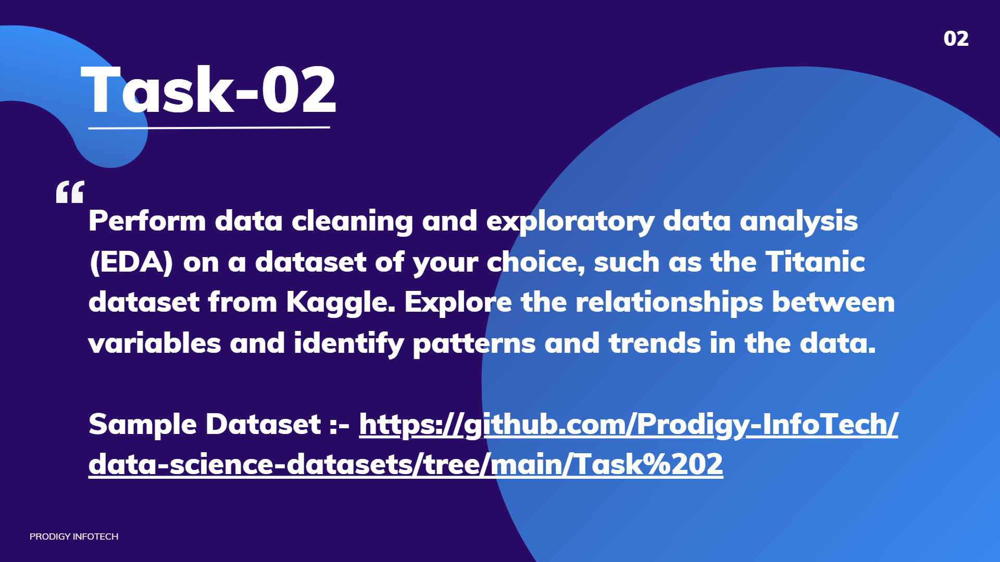

# PRODIG_DS_02

# Prodigy Infotech – Data Science Internship (Task 2)

Hi there!  
I'm **RITHIK CA**, and this repository showcases my submission for **Task 2** of the **Prodigy Infotech Data Science Internship**. In this task, I performed **Data Cleaning**, **Exploratory Data Analysis (EDA)**, and **Machine Learning Modeling** on the famous Titanic dataset to uncover trends and build predictive models.

---

## 🌍 About the Dataset

I worked with the [**Titanic Dataset**](https://www.kaggle.com/c/titanic/data), which contains information about passengers aboard the RMS Titanic. Key features include:

- `PassengerId`  
- `Survived` (target variable)  
- `Pclass` (ticket class)  
- `Name`  
- `Sex`  
- `Age`  
- `SibSp` (siblings/spouses aboard)  
- `Parch` (parents/children aboard)  
- `Fare`  
- `Embarked` (port of embarkation)  
...and more!

---

## 🧰 Tools & Libraries

This project was completed using **Python** in a **Jupyter Notebook**, leveraging:

- `pandas` & `numpy` → data handling and cleaning  
- `matplotlib` & `seaborn` → visualizations  
- `scikit-learn` → building and evaluating ML models  
- Jupyter Notebook → coding and presenting analysis  

---

## 🔍 What I Did – A Quick Walkthrough

### 1. **Getting to Know the Data**
- Loaded the dataset with `pandas`  
- Explored structure, column types, and missing values  

### 2. **Data Cleaning**
- Dropped irrelevant columns (`Ticket`, `Cabin`)  
- Imputed missing values in `Age` and `Embarked`  
- Converted categorical columns for modeling  

### 3. **Exploratory Data Analysis (EDA)**
Created insightful visualizations to understand trends:

- Bar plots & pie charts for survival distribution  
- Count plots comparing `Sex`, `Pclass`, and `Embarked` vs `Survived`  
- Histograms & boxplots for `Age`, `Fare`, `Parch`  
- Correlation heatmap for numerical feature relationships  

### 4. **Modeling & Evaluation**
Trained and compared multiple classification models:

- **Logistic Regression**  
- **Support Vector Machine (SVM)**  
- **Naive Bayes**  
- **K-Nearest Neighbors (KNN)**  
- **Decision Tree**  

Evaluation was done using accuracy scores and confusion matrices.

---

## 💡 Key Takeaways

- **Gender Matters**: Females had higher survival rates than males.  
- **Class Counts**: 1st-class passengers had better survival chances.  
- **Embarkation Point**: Passengers from Cherbourg (C) had higher survival rates.  
- **Top Model**: Naive Bayes performed best among the models tested.  

---

## 📊 Model Performance Summary

| Model                   | Accuracy Score |
|-------------------------|----------------|
| Naive Bayes             | 0.76           |
| Logistic Regression     | 0.75           |
| Decision Tree           | 0.74           |
| Support Vector Machines | 0.66           |
| K-Nearest Neighbors     | 0.66           |

---

## 🎯 Conclusion

This task was a fantastic exercise in cleaning real-world data, exploring relationships using EDA, and applying classification algorithms for prediction. It reinforced the importance of **preprocessing**, **visual analysis**, and **model comparison** in data science workflows.

---

Thanks for stopping by and reviewing my work! 😊
